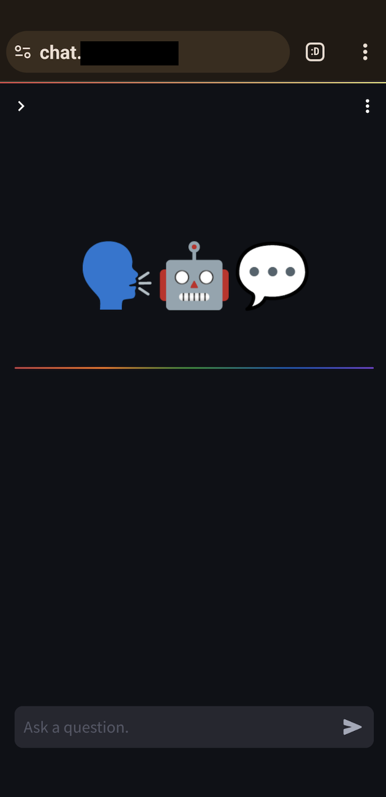
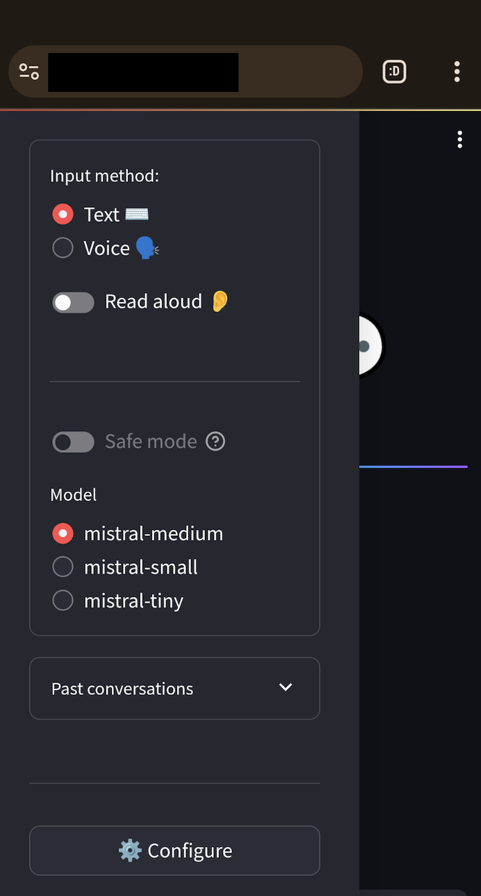
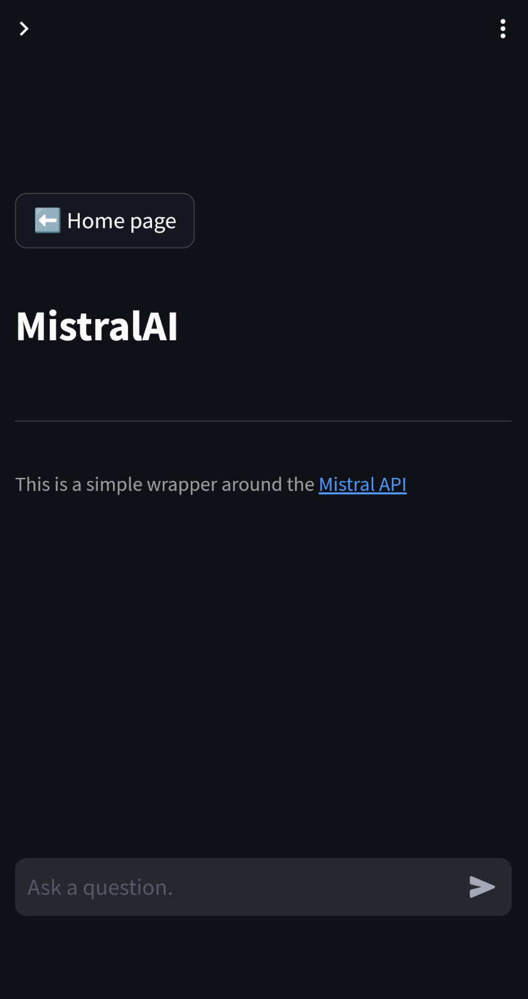

# CHANGE LOG

*NEXT RELEASE* -> soon...™️

## 0.0.9

- Moved settings to main chat area and off of the sidebar!

## 0.0.8

- interrupt button!
- speak button always appears below last bot reply
- bugfixes
- UI tidying - toggles, containers, rainbow header

<figure>
    
    
</figure>

## 0.0.7
- error message when auth.yaml is missing
- workaround to fight column responsiveness on mobile: column_fix()
- page routing feature
- settings page
- favicon

## 0.0.6
- re-arranged sidebar elements
- bugfix: prompt would run again when user interacted with sidebar
- added a changelog
- bugfix: save_chat_history() desc was only set for debug mode

## 0.0.5
- forked project into a new repository
- reworked st.session_state, now using an appstate class to handle app state

## 0.0.1

